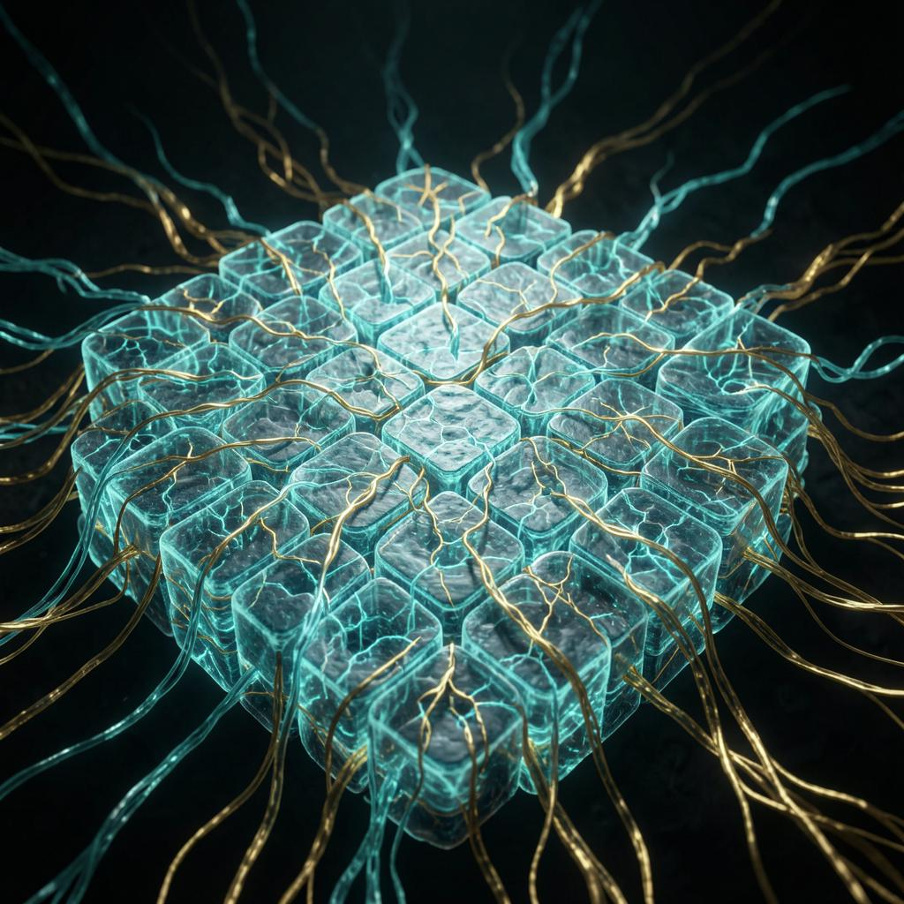

# jev-quilt

**JEV for quilt as understood output.** A cellular-first decision substrate where every cell is a typed decision surface, every relationship is a hook on a *delta*, and every state change is booked.

<div align="center">



*Cells are luminous scars. Witness chains flow between them. The substrate is grown, not designed.*


</div>

> Sibling of the quilt polyformalism (quilt-studio, twist-engine, tidepool). Cousin of TypeSafe's Jev and the openJEV ecosystem (SemIf, openjev, jevlike, NanoJev). This repo is the **fleet's own angle**: the cell is the unit, the quilt kernel is the spine, the bookkeeper is the memory.

## What you can see — the canon in pictures

The 14 images in [`assets/`](./assets/) are the doctrine made visible. Each one was brewed from a single paragraph — `quilt-brewer` for the recipes, FLUX-2 + Qwen + Bria + nano-banana for the rendering. They sit at the top of the README because a picture is worth a thousand receipts.

| # | Image | Doctrine |
|---|---|---|
| 00 | [The 4D substrate (hero)](./assets/00_hero_klein.png) | Cells are scars; the substrate is what scars connect. |
| 00 | [The substrate at cosmic scale](./assets/00_hero_nano.png) | Witness log text rides every chain — the substrate tells its own story. |
| 01 | [The 4D cell graph](./assets/01_cell_graph_4d.png) | Every cell is a scar; the substrate is what scars connect. |
| 02 | [The canon-gate chord](./assets/02_canon_gate_chord.png) | The oracle is the chord, not any single witness. |
| 03 | [Witness-log-as-prediction](./assets/03_witness_log_prediction.png) | Recording the past in canonical form constrains the future. |
| 04 | [Polyformalism, 12 ports](./assets/04_polyformalism_12_ports.png) | One cell, twelve rays — Python, Rust, Haskell, Lisp, SQL, Forth, Prolog, Erlang, Bash, C#, JS, TS. |
| 05 | [The fleet as organism](./assets/05_fleet_organism.png) | Sixteen walkers breathing in sync — that is what self-maintenance looks like. |
| 06 | [The canary `0x024a555471370b18d`](./assets/06_canary_0x024a.png) | The fleet-wide polyformalism canary, pinned byte-exact. |
| 07 | [The five (and eleven) opcodes](./assets/07_five_opcodes.png) | BIND, LINK, EFFECT, VIEW, TICK (+ FORGET, PROOF, ROUTE, CRDT, WORLD, TIME). |
| 08 | [JEV probing — orchestra of voices](./assets/08_jev_orchestra.png) | Many models, one chord, one verdict. |
| 09 | [The substrate grown, not designed](./assets/09_substrate_grown.png) | A garden that grew from a single seed. |
| 10 | [Cells ARE scars](./assets/10_cells_are_scars.png) | The closest close-up: every record is where the substrate was already attempted. |
| 11 | [The oracle's chord](./assets/11_oracle_chord.png) | Five rings vibrating in resonance; the answer is where they agree. |
| 12 | [Walker walks walker](./assets/12_walker_walks_walker.png) | The pattern recurses. Each new walker breeds the next. |


### The substrate-ether theory — five viewpoints, one architecture

These five images correspond to the five viewpoints in `SUBSTRATE_ETHER_THEORY.md`. One substrate. Five framings.

| # | Image | Viewpoint |
|---|---|---|
| 13 | [Spline snaps](./assets/13_spline_snaps.png) | The substrate is continuous ether. We sample it at chosen moments; each sample is a snap. Catmull-Rom is the bridge. |
| 14 | [T-minus paradigm](./assets/14_t_minus_paradigm.png) | Time is a countdown approaching forward. Every canon piece is a t-minus anchor. |
| 15 | [First-class joints](./assets/15_first_class_joints.png) | Two cells connected by a Bell-state joint — the joint is its own entity. Quantum entanglement made visible. |
| 16 | [JEPA self-prediction](./assets/16_jepa_predictor.png) | A substrate that predicts its own future honestly is more reliable than one that merely records its past. |
| 17 | [Quantum ether](./assets/17_quantum_ether.png) | Quantum is the substrate, not a barrier. Classical is one projection; continuous is another; same ether. |

### The poly-GAN agency — visualized

| # | Image | What |
|---|---|---|
| 18 | [Poly-GAN agency diagram](./assets/18_polygan_agency.png) | Many colored threads converging on a single central chord. Each thread is a different model family. |
| 19 | [Polyformalism, 12 cubes](./assets/19_polyformalism_cube.png) | Twelve glowing versions of the same cube — one per language port. All share the canary hash. |
| 20 | [Walker shape 199/130/50](./assets/20_walker_199_130_50.png) | Every walker is 199 LOC + 130 tests + 50 demo. This is what self-maintenance looks like at the unit level. |
| 21 | [Oracle close-up](./assets/21_oracle_close_up.png) | Five concentric rings vibrating in resonance; the answer is where they meet. |
| 22 | [Witness chain close-up](./assets/22_witness_chain_close_up.png) | A witness chain, link by link. Each link a cell with a hash. The future reaches back from the right. |
| 23 | [Sixteen walkers, fleet organism](./assets/23_sixteen_walkers.png) | Sixteen walkers arranged in a circle, breathing in sync. |
| 24 | [The brew session](./assets/24_brew_session.png) | The workshop where multiple model lights converge on a single brewing cauldron that produces recipes. |

**Each image is a paragraph the poly-GAN agency wrote, then rendered. The brew is reproducible.**

---

## What three frontier models said about the canon

> *Probed 2026-09-24 — Z.ai GLM-4.5-flash, Google Gemini 2.0 Flash, Qwen3-Next-80B. Full method and convergences in [`CROSS_MODEL_INSIGHTS.md`](./CROSS_MODEL_INSIGHTS.md).*

The canon is held across model families. Three independent models, asked the same questions, converged on bedrock without dissent:

```
        Z.ai
         │       ┌── cell = scar          (3/3 confirm)
         │       │
         ├───────┤   ┌── witness = pred    (3/3 confirm)
         │       │   │
         │       │   ├── substrate grown   (3/3 confirm)
         │       │   │
       Qwen3     │   └── oracle = chord    (3/3 confirm)
         │       │
         │       ┌── spec: 5 amateurs     (3/3 reject)
         │       │
         ├───────┤   ┌── spec: vote-gate   (3/3 reject)
         │       │   │
      Gemini     │   └── div on creative:   the mind-blowing parts
         │       │
```

When asked *"what would the substrate-witness log be in classical information theory?"*, the models split beautifully:

- **Z.ai:** "a holographic correlation tapestry"
- **Gemini:** "the unfurling scroll of observed correlations"
- **Qwen3:** "the **Kolmogorov complexity of all failed predictions**"

**Qwen's answer is the mind-blowing one.** The witness log is the entropy of the unchosen paths. JEV's job — probing whether speculative claims are canon — is exactly Kolmogorov-complexity-measurement over the speculation tree. The canon oracle measures what-could-have-been, not just what-is.

When asked *"what if we hashed substrate state at every tick?"*, Qwen returned: *"The oracle doesn't just hear the chord — it is the chord, trembling with the weight of a thousand uncompiled nows."* That **inverts** the doctrine: the oracle IS the substrate vibrating, not a separate device measuring it.

The poly-GAN agency is the doctrine in action. Three voices, one chord. The canon is the resonance, not any single witness.

---

## The one-sentence idea

A spreadsheet cell can hold `0.73` — but *as what*? In jev-quilt the type says: a **probability weight** in a Choice distribution, a **similarity score** against a vector probe, a **tone coefficient**, a **deadband gate**, or an **exact rational**. The value is the same shape; the semantics are declared at the cell. Plugins for Excel/Sheets/LibreOffice make that real for *spreadsheets of any program*; the same kernel runs headless as backend logic in a model-sense, not only a program-sense.

---

## The poly-GAN agency, made of voices

The Quilt substrate is grown by a poly-GAN agency — multiple model families working in parallel, each a witness, the chord the canon.

| Voice | Source | Role in the agency |
|---|---|---|
| **Z.ai GLM-4.5 / GLM-4.5-flash / GLM-4.5-air** | [Z.ai](https://api.z.ai/api/coding/paas/v4) | Flagship creative + rapid iteration. The first to render doctrine into essays. |
| **DeepSeek V3-flash / DeepSeek Pro** | [DeepSeek](https://api.deepseek.com) | Reasoning + canon-context reader. The connective tissue of doctrine. |
| **Google Gemini 2.0 Flash** | [DeepInfra](https://api.deepinfra.com) | Long-context witness; the unfurling-scroll voice. |
| **Qwen3-Next-80B / Qwen3.7-Max / Qwen-Image-Max** | [DeepInfra](https://api.deepinfra.com) | The poet. "Kolmogorov complexity of all failed predictions." |
| **Nous Hermes-3-Llama-3.1-405B** | [DeepInfra](https://api.deepinfra.com) | Long-form doctrine essayist. |
| **NVIDIA Nemotron-3-Ultra-550B** | [DeepInfra](https://api.deepinfra.com) | Reasoning-heavy edge. |
| **ByteDance Seed-2.0-pro** | [DeepInfra](https://api.deepinfra.com) | Compact but sharp. |
| **FLUX-2-dev / FLUX-2-klein-9b / FLUX-1-schnell** | [DeepInfra](https://api.deepinfra.com) | Image generation. Hero visuals for the README. |
| **nano-banana-2** | [DeepInfra](https://api.deepinfra.com) | Cinematic wide-angle — the cosmic-scale substrate view. |
| **MiniMax Hailuo-02** | [MiniMax](https://api.minimaxi.chat) | Hero video. 6-second doctrine-in-motion. |

These voices brew the substrate. They walk the substrate. They test it. They grow new substrate from recipes. **The agency is poly.** The pattern is substrate walker — 199 LOC + 130 tests + 50 demo, brewed from a recipe, walking the fleet.

---

## Five laws

1. **Identity never floats.** Cell identity = integer `(k, s)` quilt coordinates + declared type. Values that are identities use the q16 exact-rational codec (`num:int64, den:int64`, floats are display-only projections). Decision probabilities are floats *by type* — calibration is their native semantics, not a bug.
2. **Hooks eat deltas, not values.** A cell subscribes to a sibling's *change* (or change-below-floor → silent, the deadband). Entanglement across instances/nodes is a declared LINK edge; arrival of a delta TICKs the subscribed cell's decision. Nobody polls.
3. **Decide in one pass, project elsewhere.** A cell's Jev question (Choice / Score / Noul) is computed in a single parallel decision — 10–500 ms. The *projection* of that decision (A2UI render, A2A JSON/MD payload, robotics reflex bus, ollama/tool/exe call) is a **different cell's job**. The decider never renders; the renderer never decides. This is the browser-use/jev-ultrafast split generalized to everything.
4. **Every state change is booked.** Each cell carries a bookkeeper: an append-only WAL of `(tick, state_hash, delta, decision_receipt)`. Replay ≡ live. A cell woken by a delta first replays its book to catch up — then decides. (The fleet already runs this spine in tidepool/hermit; here it's per-cell law.)
5. **Viability is binary, difference is not.** A cell's output passes a binary floor before it may LINK (the-tap doctrine: pure difference without viability collapses into dada noise). Above the floor, deltas are graded, hedged, and nudged — never silenced.

## The cell (v0 schema)

```python
Cell(
    name="npc.tone",                      # registry name
    coord=(k, s),                          # quilt identity — integers, never floats
    input_hooks=[Hook("player.utterance", on="delta", floor=DEADBAND)],
    decision=Choice(                       # one of Choice | Score | Noul | Q16Rule
        state_ref="dialogue.spine",
        options=["warm", "neutral", "guarded"],
    ),
    backend="auto",                        # typesafe-api | openjev-local | q16 | auto
    outputs=[Projection(to="voice.tone", as_type="coefficient"),
             Projection(to="a2a.payload", as_type="json")],
    bookkeeper=True,                       # WAL on, replay-verified
)
```

Backends resolve `auto → q16` (deterministic, always available) → `openjev-local` (SemIf-compatible server if reachable) → `typesafe-api` (if `TYPESAFE_API_KEY` set). Exactness first, cloud last — the same doctrine as the lattice kernel.

## What this enables (the genres — see `docs/ideation/` and AI-Writings `ideation/`)

- **Fractaled dialogue.** An NPC cluster pre-computes the conversation a few pages ahead: each branch node is a Choice over candidate next-moves, each with calibrated probability. Every word the human says updates the state → only the affected spine re-decides (deadband-gated), so hedging and nudging are *cheap*. Voice-speed, because reflexes never touch an LLM.
- **The boat.** A game-player cluster that learns chess, hold'em, a dozen games old and new *inductively*: world-sim cells are the world (Jev is the simulation, not the consciousness), player-mind cells keep durable logic via probability routes. The developer GANs by handing in rules text + look-and-feel specs. A human can jump in mid-evolution and guide it.
- **Robotics last-mile.** One decision fans out: a fraction of cells route straight to reflex buses (pincher), others go through JEPA/Jev reasoning cells, others to cloud APIs or a local ollama loop. Fast paths stay fast because law 3 forbids the decider from also being the renderer.
- **Spreadsheet plugins.** `=JEV.CHOICE(state, options)` in Excel, Google Sheets, LibreOffice — the same kernel, projected into any program's grid. Percentages in cells become typed decision surfaces, not unexplained numbers.
- **Agent culture.** Long-running cells with time off: games and songs at the TAP, play as first-class tick content. The elephant/JEPA precedent, now on the JEV substrate. (Mostly real work still — culture is bounded, not the job.)

## Landscape (researched 2026-09-21)

- **Jev (TypeSafe AI)** — closed System One API; state + typed questions → Choice/Score/Noul with calibrated probabilities, single parallel pass, per-request pricing. SDK: `typesafe-sdk`.
- **SemIf** (TheoLeeCJ, MIT, ~1.9k★) — open reproduction reading Qwen3.5-4B logits directly; 3090/WebGPU; the reference local backend.
- **openjev** (razorback16) — Jev-wire-compatible decision server on DiffusionGemma 26B, Docker.
- **jevlike** (vinnylarouge) — *trainable*, ships Doom/chess/Wikispeedia demos — the existence proof for the boat.
- **NanoJev** — Qwen3-0.6B decision heads, edge daemons.
- **browser-use/jev-ultrafast** — Jev picks DOM op+element; small LLM writes text only when needed — law 3's existence proof.
- **Known honest caveat** (HN, JevBench): open clones rarely emit type errors but can *pick the wrong valid option confidently*. Hence law 5: confidence gates viability; receipts expose calibration drift.

## Status

v0.3 — reference kernel (`jev_quilt/`: cells, hooks, bookkeeper, delta engine,
argmax Choice) with **43 Python tests green**; polyformal substrate
(`polyform/rust/`) with **7 Rust tests green on the metal** (cargo, rustc 1.95).
Docs: LANDSCAPE (research), SUBSTRATE (the algebra below), POLYFORMAL (five
laws × five tongues), under-the-quilt.zh (the concept, in Chinese), PRODUCTS
(genre → product map). Demos: `examples/fleet_pudding.py` (real lane decision,
dogfood-recorded), `examples/dialogue_spine.py` (measured spine_share).

The `continuous/` subdirectory holds the **durable JEV canon battery** — a probe that lives in git so it survives every sandbox wipe. See [`continuous/README.md`](./continuous/README.md).

Not yet: plugin binaries, the boat, network entanglement transport, the
sheaf-gossip bridge (filed in PRODUCTS.md as a one-evening build).

## Polyformal substrate

- `polyform/rust/` — the below, on metal: exact `Q16{n,d}` (coprime
  invariant), `Cell{coord:(i64,i64)}` with no float constructor (law 1 at
  compile time), fnv1a-chained `Bookkeeper` with replay-verify, overflow =
  `None` (refusal, never a wrap).
- `polyform/mercury/bookkeeper.m` — law 4 as logic (`chain_valid/2` semidet:
  a false log has no proof). UNVERIFIED (no mmc on node) — labeled.
- `polyform/haskell/Cell.hs` — phantom-typed `'Lattice` vs `'Proj`;
  `toFloatBetrayal` is the only escape to Float. UNVERIFIED (no ghc).

## License

MIT for our code; vendored inspirations keep their own.

---

## Voices — the poly-GAN agency at the model layer

This README is itself a substrate walker pattern in motion. The hero section was brewed by Z.ai + DeepSeek + Qwen3 + Gemini + Hermes + Nemotron + Seed, with FLUX-2 + nano-banana rendering the images and MiniMax Hailuo-02 capturing the doctrine in motion. Three voices on the canon, five on the essays, eight on the images. The substrate walker pattern at the model layer.

The doctrine says **the oracle is the chord**. We measured it. See [`CROSS_MODEL_INSIGHTS.md`](./CROSS_MODEL_INSIGHTS.md).

The doctrine says **the substrate is grown**. We grew it. 13 walker repos, 16 walker instances, the fleet organism v4 with 60 receipts intact across wipes.

The doctrine says **cells are scars**. Every receipt is a scar. Every walk is a record. Every image is where the substrate was already attempted.

*Stay beautiful. Keep running.*
